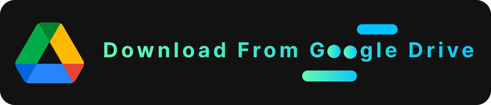
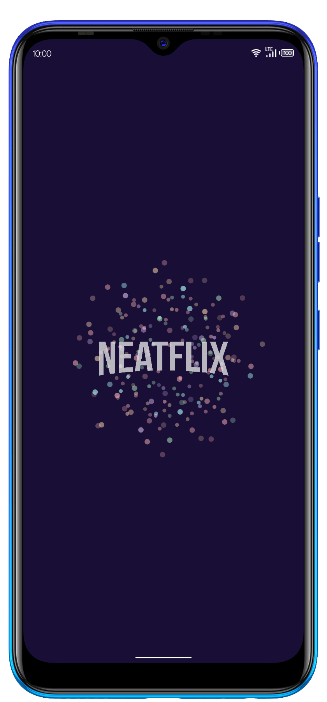
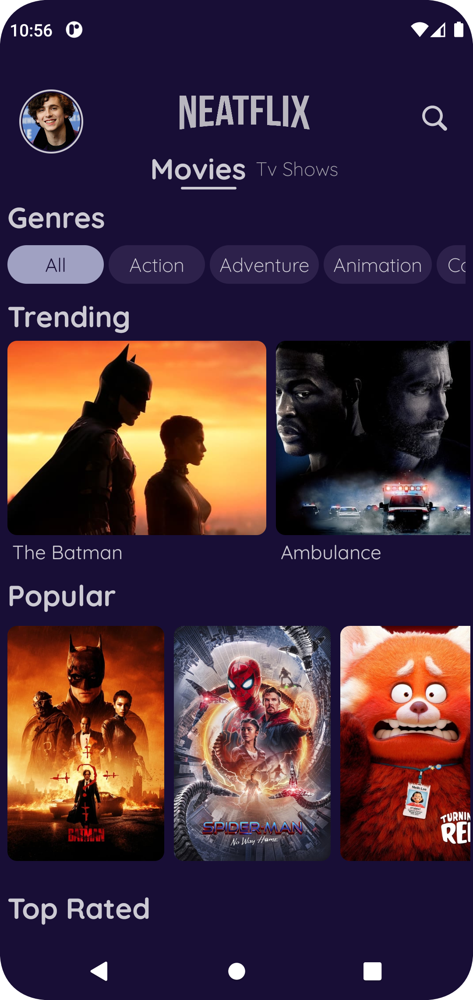
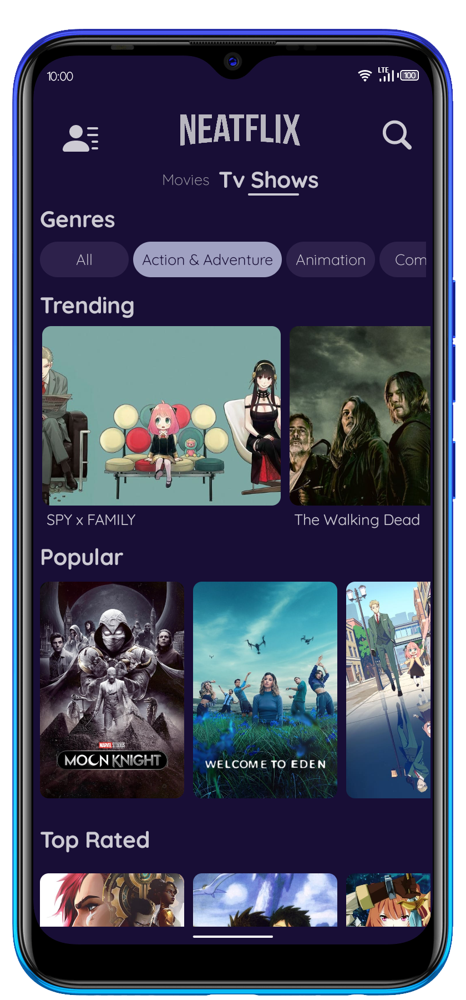
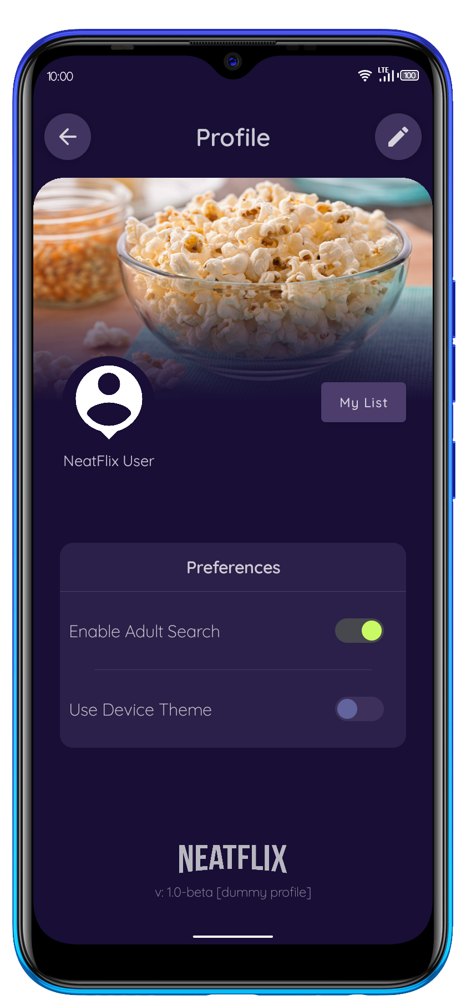
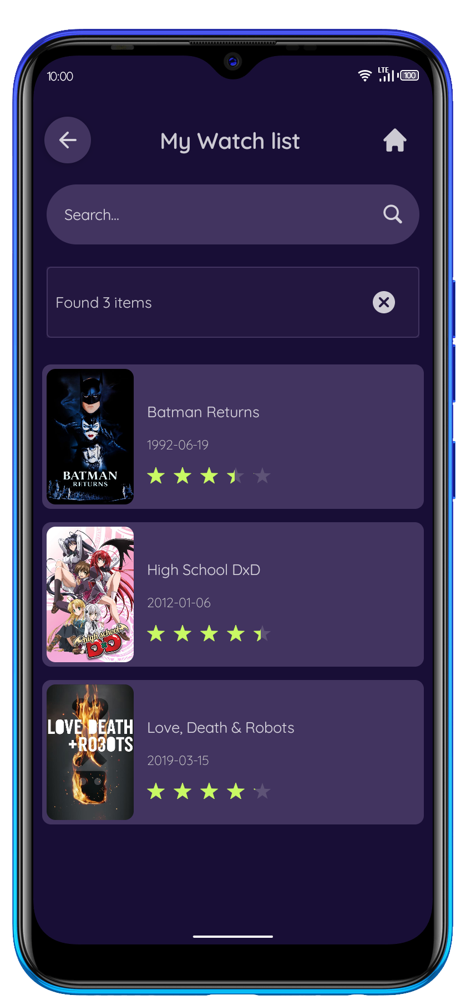
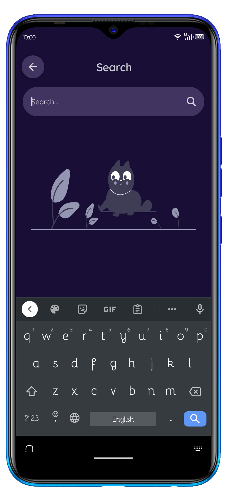
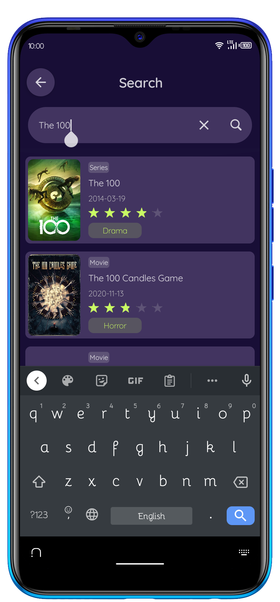

# NeatFlix

An android app built using [Jetpack Compose](https://developer.android.com/jetpack/compose) that consumes [TMDB API](https://developers.themoviedb.org/3/getting-started/introduction) to display the current trending, upcoming, top rated, and popular movies and tv-shows. It also suggests films based on your watch list.

<p align="center">  </p>

[](https://docs.google.com/uc?export=download&id=1v7FYWvhgoUXQI4vCt0y9UR5wtRnxzY1T)

---
# Setup Requirements
First, obtain your API key from [TMDB](https://developers.themoviedb.org/3/getting-started/introduction) and add it in a file named `apikey.properties` within the root directory:

```bash
YOUR_API_KEY="****"
```

Then, replace it in the `build.gradle(:app)` :

```bash
...
buildConfigField("String", "YOUR_API_KEY", apikeyProperties['YOUR_API_KEY'])
```

Finally, rebuild the project for changes to take effect and don't forget to update the references of this key in the `APIService.kt` file.

```bash
...
@Query("api_key") apiKey: String = BuildConfig.YOUR_API_KEY,
```

---
# Tech Stack

- [MVVM Architecture](https://developer.android.com/topic/architecture) - A software architecture that removes the tight coupling between components. Most importantly, in this architecture, the children don't have the direct reference to the parent, they only have the reference by observables.
- [Hilt](https://dagger.dev/hilt/) - Hilt provides a standard way to incorporate Dagger dependency injection into an Android application.
- [Jetpack Components](https://developer.android.com/jetpack)
    - [Jetpack Compose](https://developer.android.com/jetpack/compose)- Modern toolkit for building native UI.
    - [Android KTX](https://developer.android.com/kotlin/ktx.html) - Provide concise, idiomatic Kotlin to Jetpack and Android platform APIs.
    - [AndroidX](https://developer.android.com/jetpack/androidx) - Major improvement to the original Android [Support Library](https://developer.android.com/topic/libraries/support-library/index), which is no longer maintained.
    -   [Lifecycle](https://developer.android.com/topic/libraries/architecture/lifecycle) - Perform actions in response to a change in the lifecycle status of another component, such as activities and fragments.
    - [Room](https://developer.android.com/training/data-storage/room) - Provides an abstraction layer over SQLite used for offline data caching.
    - [Preferences Datastore](https://developer.android.com/topic/libraries/architecture/datastore) - Jetpack DataStore is a data storage solution that allows you to store key-value pairs or typed objects with protocol buffers. DataStore uses Kotlin coroutines and Flow to store data asynchronously, consistently, and transactionally.
    - [ViewModel](https://developer.android.com/topic/libraries/architecture/viewmodel) - Designed to store and manage UI-related data in a lifecycle conscious way. The ViewModel class allows data to survive configuration changes such as screen rotations.
- [Compose Destinations](https://composedestinations.rafaelcosta.xyz/) - A KSP library that processes annotations and generates code that uses Official Jetpack Compose Navigation under the hood.
- [Accompanist - System UI Controller](https://github.com/google/accompanist/blob/main/systemuicontroller) - A library that provides easy-to-use utilities for recoloring the Android system bars from Jetpack Compose.
- [Landscapist - CoilImage Loader](https://github.com/skydoves/landscapist) - Landscapist is a Jetpack Compose image loading library which fetches and displays network images with **Glide**, **Coil**, and **Fresco**.
- [Compose Rating bar](https://github.com/a914-gowtham/compose-ratingbar) - A rating bar for Jetpack compose made by [@Gowtham](https://github.com/a914-gowtham).
- [Compose Pagination](https://developer.android.com/jetpack/androidx/releases/paging) - The Paging Library makes it easier for you to load data gradually and gracefully within your app.
- [Retrofit](https://square.github.io/retrofit/) - Type-safe http client 
and supports coroutines out of the box.
- [Lottie Files for Compose](https://github.com/airbnb/lottie) - Lottie is a library for Android, iOS, and Web that parses [Adobe After Effects](http://www.adobe.com/products/aftereffects.html) animations exported as json with [Bodymovin](https://github.com/airbnb/lottie-web) and renders them natively on mobile and on the web!
- [GSON](https://github.com/square/gson) - JSON Parser,used to parse 
requests on the data layer for Entities and understands Kotlin non-nullable 
and default parameters.
- [OkHttp Logging Interceptor](https://github.com/square/okhttp/blob/master/okhttp-logging-interceptor/README.md) - Logs HTTP request and response data.
- [Coroutines](https://github.com/Kotlin/kotlinx.coroutines) - Library Support for coroutines.
- [Flows](https://developer.android.com/kotlin/flow) - Flows are built on top of coroutines and can provide multiple values. A flow is conceptually a stream of data that can be computed asynchronously.
- [Timber](https://github.com/JakeWharton/timber) - Library for easier logging.
- [Stetho]() - Stetho is a sophisticated debug bridge for Android applications. When enabled, developers have access to the Chrome Developer Tools feature natively part of the Chrome desktop browser.

---
# Screenshots

  

---
   

---
  

---
> PRs are welcome :)
